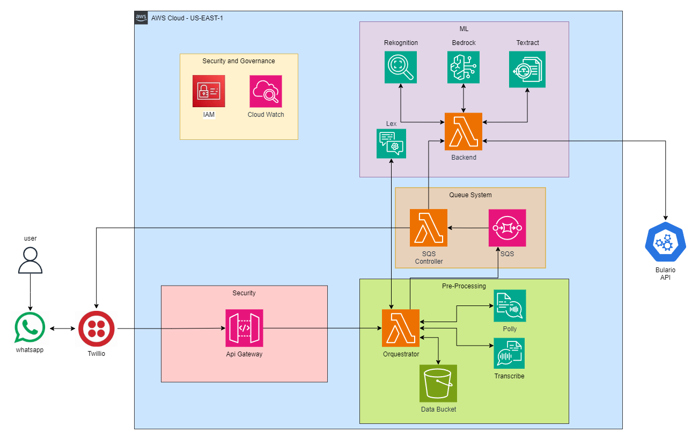

# Luz Guia

## Descrição

O projeto Luz Guia visa fornecer soluções de acessibilidade visual utilizando serviços de inteligência artificial da AWS, como Rekognition, Textrct, Lex, Bedrock, Polly e Transcribe. As funcionalidades principais incluem leitura de textos e documentos e Informações sobre remédios.

## Sobre o problema
Pessoas com deficiência visual enfrentam desafios significativos ao interagir de forma independente e segura com o ambiente ao seu redor. Isso inclui a leitura de documentos, textos e a obtenção de informações sobre remédios. Este projeto busca resolver esses problemas, proporcionando autonomia e segurança através do uso de tecnologias como reconhecimento de imagem, leitura de textos e conversão de informações visuais em áudio. Nosso objetivo é promover uma melhor integração e acessibilidade no dia a dia dessas pessoas.

## Funcionalidades

### 1. Leitura de Textos e Documentos
- **Cenário:** Um usuário recebe uma carta ou documento importante pelo correio.
- **Serviço Utilizados:** Amazon Textract, Amazon Lex e AWS Polly.
- **Descrição:** O documento é escaneado e o texto é extraído utilizando Amazon Textract. Em seguida, o texto é convertido em áudio pelo Polly para que o usuário possa ouvi-lo.

### 2. Leitura de Nomes de Remédios e Informações
- **Cenário:** Um usuário, que é deficiente visual, precisa começar a tomar um novo medicamento. Ele usa o chatbot de acessibilidade em seu smartphone para tirar uma foto do rótulo do medicamento. O chatbot identifica o medicamento e envia a bula correspondente. Ele escolhe receber as informações em áudio e ouve as instruções importantes sobre o medicamento usando o Amazon Polly. Agora, ele pode tomar o medicamento com confiança, sabendo que tem acesso rápido e independente às informações necessárias.
- **Serviços Utilizados:** AWS Rekognition, Amazon Textract, Amazon Lex, Amazon Bedrock e AWS Polly.
- **Descrição:** O usuário captura uma imagem do rótulo do medicamento usando o dispositivo móvel. O Amazon Rekognition analisa a imagem, extrai o nome do medicamento e a busca da bula correspondente é feita em uma API. Um PDF da bula é disponibilizado para download, enquanto as principais informações (obtidas por meio do Amazon Bedrock) são convertidas em áudio por meio do Amazon Polly, oferecendo acesso rápido e seguro às instruções essenciais.

## Arquitetura

</img>

## Dificuldades Conhecidas

### 1. Limitação do TWILIO

**Problema:**
A ferramenta TWILIO possui uma limitação quanto ao tempo de resposta, causando TIME OUT em algumas funcionalidades devido ao tempo necessário para preparar a resposta.

**Solução:**
Implementado o serviço de filas SQS da AWS para gerenciar as requisições e melhorar a performance, evitando o problema de TIME OUT.

### 2. Limitação da API de Verificação de Bulas de Remédios

**Problema:**
A API utilizada para verificação de bulas de remédios possui uma limitação no número de requisições permitidas em um curto período, resultando em erros quando várias tentativas são feitas rapidamente.

**Solução:**
Adicionado um delay entre as tentativas de requisição para distribuir melhor as chamadas e evitar atingir o limite de requisições permitidas.

***
